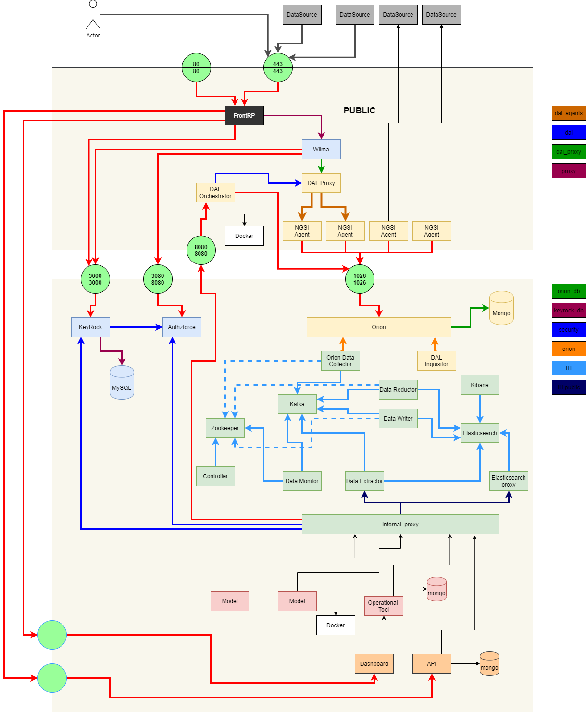

# The components



# DNS Configuration
In order to expose the PIXEL services you need to create several DNS Entries
If your domain is ```${PIXEL_DOMAIN}``` and public Host IP is ```${PUBLIC_IP}``` you have to create :
```
dashboard${PIXEL_DOMAIN}.       A ${PUBLIC_IP}
api-dashboard${PIXEL_DOMAIN}.   A ${PUBLIC_IP}
id${PIXEL_DOMAIN}.              A ${PUBLIC_IP}
dal${PIXEL_DOMAIN}.             A ${PUBLIC_IP}
data${PIXEL_DOMAIN}.            A ${PUBLIC_IP}
api-ot${PIXEL_DOMAIN}.          A ${PUBLIC_IP}
ot${PIXEL_DOMAIN}.              A ${PUBLIC_IP}
admin${PIXEL_DOMAIN}.           A ${PUBLIC_IP}
```

For example for Bordeaux the domain is ```.frbod.pixel-ports.eu```and the public IP is ```163.172.188.163```

So the DNS configuration is :

```
dashboard.frbod.pixel-ports.eu.       A 163.172.188.163
api-dashboard.frbod.pixel-ports.eu.   A 163.172.188.163
id.frbod.pixel-ports.eu.              A 163.172.188.163
dal.frbod.pixel-ports.eu.             A 163.172.188.163
data.frbod.pixel-ports.eu.            A 163.172.188.163
api-ot.frbod.pixel-ports.eu.          A 163.172.188.163
ot.frbod.pixel-ports.eu.              A 163.172.188.163
admin.frbod.pixel-ports.eu.           A 163.172.188.163
```


# Installation process
The installation use ```docker-compose```

1. Install the [Core Components](docker/core/README.md)
2. Install the [Public Components](docker/public/README.md)
