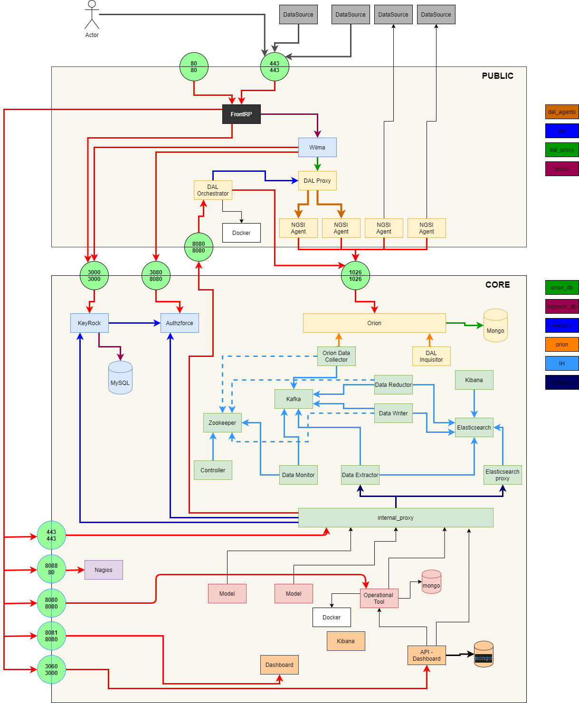

# The components



# Installation process
The installation use ```docker-compose```

1. Install the [Core Components](docker/core/README.md)
2. Install the [Public Components](docker/public/README.md)


curl -H "X-Auth-Token: KV4R5spon2ZC" http://172.41.1.3:8080/api/images